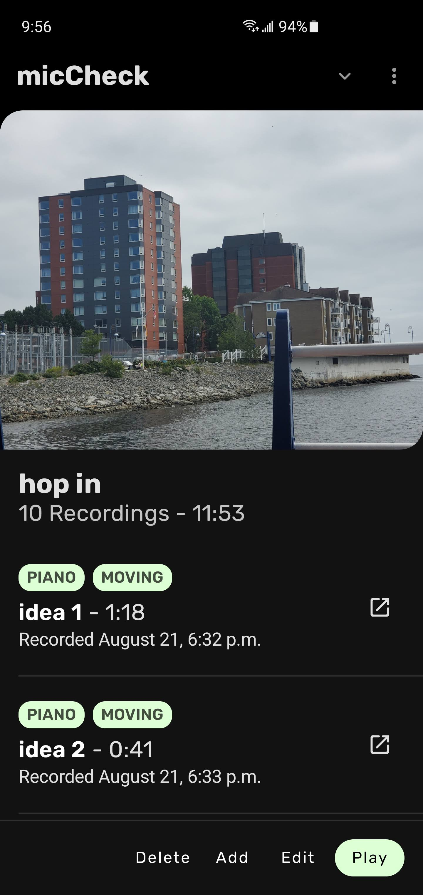
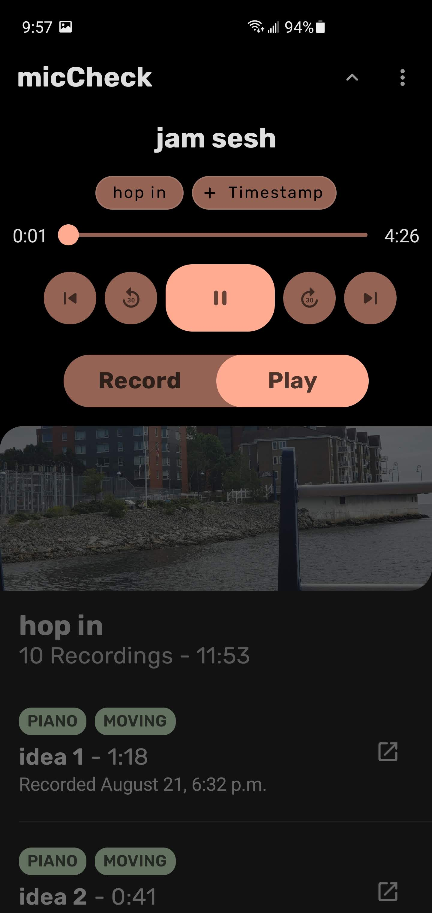
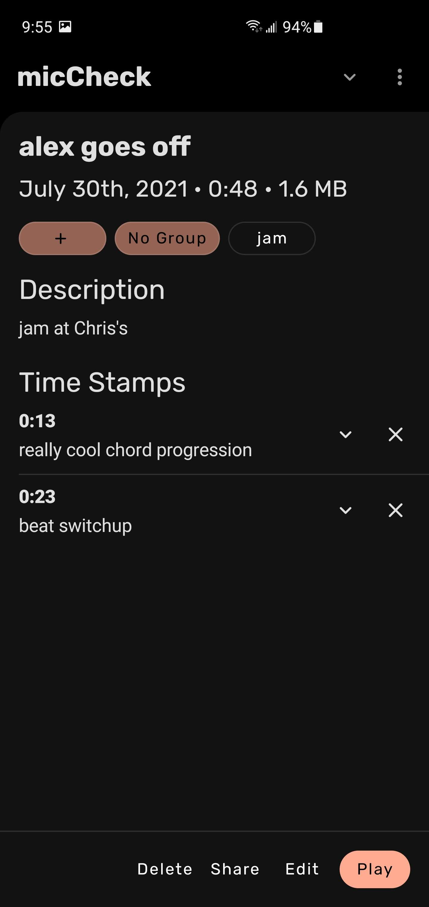
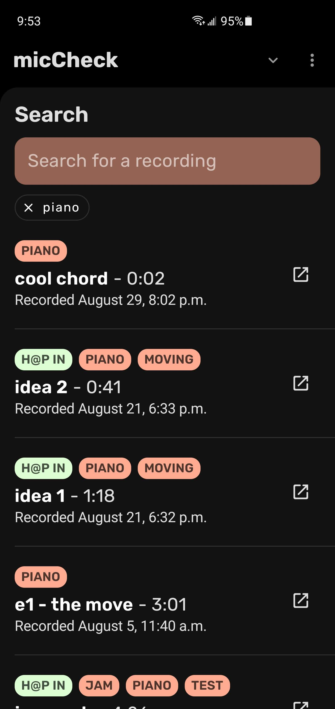

# MicCheck - Android Audio Recorder & Organizer (Jetpack Compose)

 - [Idea](#idea)
 - [Screenshots](#screenshots)
 - [About MicCheck](#about)
 - [Note from the author](#note-from-the-author)
	 - [Notable libraries used](#notable-libraries-used)

## Idea
All modern phones have great apps preloaded on them for creating and managing photos and videos - the Camera and Gallery apps. One extremely common file format has been largely neglected on Android, though, that being Audio.  

**The main idea behind MicCheck was to create an app for audio that is comparable to the Camera and Gallery apps built in for images.**

## Screenshots 

## About
MicCheck is a simple Android app written with Jetpack Compose that allows for a better audio recording and audio note taking experience, with a Material You inspired UI.

MicCheck allows users to record, organize, and manage audio recordings with features such as Groups, tagging, timestamping, and more.

 - **Groups** - Group your recordings in a manner that looks and feels like an Album, but of course consists of only your recordings.
 - **Tagging** - Tag recordings in order to organize recordings in a looser way than using Groups.
 - **Search** - Find recordings and timestamps by tag, name, date, or group using a customized implementation of xdrop's FuzzyWuzzy search.
 - **Timestamps** - Want to remember that your professor talked about a specific topic at a specific point in your recording? Or make note of a key change in a song you recorded? Use timestamps to better organize the contents of your recordings too.
## Note From the Author
This app is my first ever attempt at writing an android app, and it was a passion project that I expect no returns from. Despite this, if you run into problems while using the app (as I am the only developer involved with this project) please submit an issue or contact me directly. 

### Notable Libraries Used -

- xdrop's fuzzy wuzzy java implementation
- Ffmpeg for Android ***(NOTE: I plan to remove this dependency soon, as it has only been used for experimental features)***
- The accompanist set of libraries for Jetpack Compose
